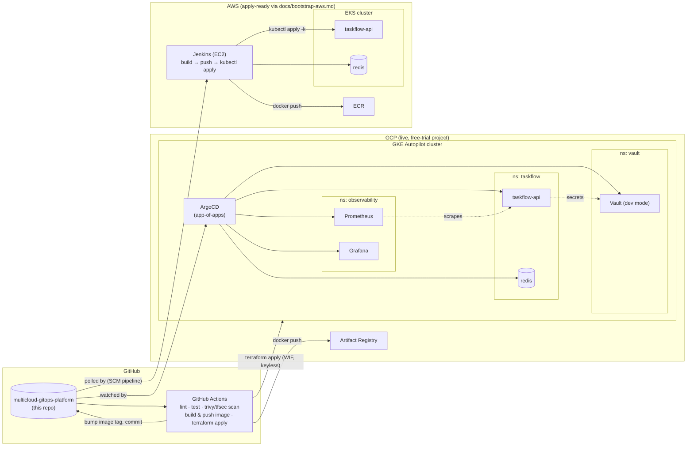
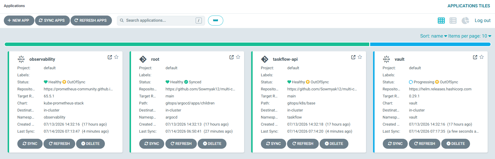
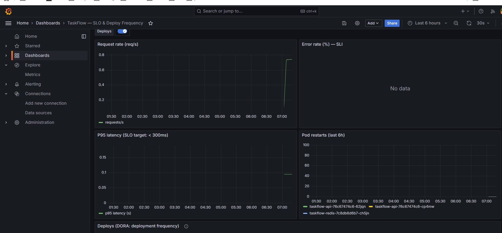
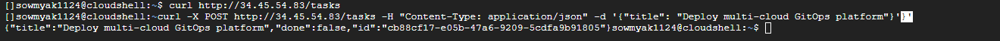

# Multi-Cloud GitOps Platform

A small task-tracking API, deployed to two clouds with two deliberately
different CI/CD patterns: on **GCP**, Terraform + GitHub Actions +
ArgoCD/GitOps (a controller pulls changes from git), and on **AWS**,
Terraform + Jenkins (a controller pushes changes straight to the cluster) —
plus Prometheus/Grafana for observability and HashiCorp Vault for secrets on
the GCP side. Built as a portfolio project to back up the claims on my resume
with something a reviewer can actually click through and inspect.

## Architecture



The loop that matters on GCP: **CI builds an image → commits the new tag
back to `gitops/k8s/base` → ArgoCD notices the git change and syncs it to
the cluster.** Nothing is ever `kubectl apply`'d by hand there.

On AWS it's the opposite, on purpose: **Jenkins builds the image, pushes to
ECR, then runs `kubectl apply` itself** — no controller watching git, no
pull-based reconciliation. Same app, same shape of cluster, intentionally
different deployment philosophy to demonstrate both.

## Screenshots

**ArgoCD — app-of-apps synced**


**Grafana — SLO & deploy-frequency dashboard, live traffic**


**Live API — real request/response**


## What this proves (resume → repo)

| Resume line | Where it lives here |
|---|---|
| AWS • GCP • Azure • GovCloud, multi-cloud | [`infra/gcp`](infra/gcp) (live, GitOps) + [`infra/aws`](infra/aws) (live, Jenkins) |
| Kubernetes orchestration, Helm, EKS/GKE | [`infra/gcp/gke.tf`](infra/gcp/gke.tf), [`infra/aws/main.tf`](infra/aws/main.tf) (EKS), [`gitops/k8s/base`](gitops/k8s/base) + [`deploy/aws/k8s`](deploy/aws/k8s) |
| GitOps/ArgoCD deployments | App-of-apps pattern in [`gitops/argocd/apps`](gitops/argocd/apps); CI → git → ArgoCD loop in [`.github/workflows/ci.yml`](.github/workflows/ci.yml) |
| Traditional/push-based CI/CD (Jenkins) | [`Jenkinsfile`](Jenkinsfile) — build → scan → push to ECR → `kubectl apply`, on a Jenkins controller provisioned by [`infra/aws/jenkins.tf`](infra/aws/jenkins.tf) |
| Terraform IaC | [`infra/gcp`](infra/gcp), [`infra/aws`](infra/aws) — remote/local state as appropriate, keyless or IAM-role auth, no hardcoded secrets |
| CI/CD automation | [`.github/workflows/ci.yml`](.github/workflows/ci.yml), [`.github/workflows/deploy.yml`](.github/workflows/deploy.yml) (GCP); [`Jenkinsfile`](Jenkinsfile) (AWS) |
| DevSecOps | `trivy` image scanning + `tfsec` IaC scanning in `ci.yml`, non-root container user in [`app/api/Dockerfile`](app/api/Dockerfile) |
| Observability, SLIs/SLOs, DORA metrics | [`observability/`](observability) — kube-prometheus-stack + a Grafana dashboard with error-rate/latency SLIs and a deploy-frequency panel |
| HashiCorp Vault, secrets lifecycle | [`security/vault/`](security/vault) — Vault dev-mode + Kubernetes auth + policy/role, consumed via Vault Agent injection |
| FinOps: cost governance, tagging | Consistent `labels`/`tags` on every resource in both Terraform stacks; SPOT node group + single NAT gateway + small Jenkins instance on AWS, Autopilot (pay-per-pod) + `google_billing_budget` alert on GCP |
| Security-conscious infra design | AWS Jenkins host uses SSM Session Manager instead of SSH (no key pair, no open port 22), its own least-privilege IAM role via EKS access entries rather than shared cluster-admin creds |
| Zero-downtime deployments | Rolling `Deployment` + `HorizontalPodAutoscaler` in [`gitops/k8s/base`](gitops/k8s/base) |

## Repo layout

```
app/api/            FastAPI + Redis task service (the thing being deployed)
infra/gcp/           Terraform: VPC, GKE Autopilot, Artifact Registry, WIF, budget — live
infra/aws/           Terraform: VPC, EKS, ECR, Jenkins EC2 — live (see infra/aws/README.md)
gitops/argocd/       ArgoCD install values + app-of-apps definitions
gitops/k8s/base/     Kustomize manifests ArgoCD actually syncs (GCP)
deploy/aws/k8s/      Kustomize manifests Jenkins applies directly (AWS)
observability/       kube-prometheus-stack values + Grafana dashboard
security/vault/      Vault values + one-time init job + injection demo
.github/workflows/   ci.yml (build/scan/push/gitops-bump), deploy.yml (terraform + ArgoCD bootstrap) — GCP
Jenkinsfile          Build/scan/push/deploy pipeline — AWS
docs/bootstrap.md    One-time gcloud setup (Cloud Shell) before the first GCP deploy
docs/bootstrap-aws.md One-time AWS setup (CloudShell) + Jenkins pipeline setup
```

## Getting started

**GCP (GitOps path):**
1. Read [`docs/bootstrap.md`](docs/bootstrap.md) — a ~10 minute, copy-paste
   Cloud Shell setup (state bucket, Workload Identity Federation, deploy
   service account). No local Terraform/gcloud install needed; everything
   after that runs inside GitHub Actions.
2. Push to `main` (or run the `deploy` workflow manually) — this applies the
   Terraform, then bootstraps ArgoCD, which pulls in everything else.
3. `kubectl port-forward svc/argocd-server -n argocd 8080:443` to watch the
   sync in the ArgoCD UI, or `-n observability svc/kube-prometheus-stack-grafana 3000:80`
   for the dashboard.

**AWS (Jenkins path):**
1. Read [`docs/bootstrap-aws.md`](docs/bootstrap-aws.md) — CloudShell,
   `terraform apply`, unlock Jenkins, create the pipeline.
2. Click **Build Now** in Jenkins (or push to `main` if you've wired up a
   webhook) — it lints/tests, builds the image, pushes to ECR, then
   `kubectl apply`s straight to EKS itself.
3. `kubectl get svc taskflow-api` for the LoadBalancer IP.

## Cost

Everything here is sized for a free-trial budget. On GCP: GKE Autopilot
(pay-per-pod, no idle node cost), short Prometheus retention with no
persistent volumes, Vault in dev mode. On AWS: SPOT worker nodes, a single
NAT gateway, and a small Jenkins instance — though EKS itself has a flat
~$0.10/hr control-plane fee regardless of usage (unlike GKE Autopilot).
`terraform destroy` in `infra/gcp` and/or `infra/aws` once you're done
capturing a demo — it's all code, so standing it back up is one
`terraform apply` away.

## Phase 2 (documented, not built)

- An Azure/AKS mirror to match GCP and AWS, using the same Terraform structure.
- Consul for service discovery/mesh alongside Vault.
- SonarCloud static analysis (needs an external account) alongside `trivy`/`tfsec`.
- Four Keys-style full DORA metrics pipeline instead of the lightweight Grafana annotation approach used now.
- Observability (Prometheus/Grafana) and Vault on the AWS side too — currently GCP-only.
