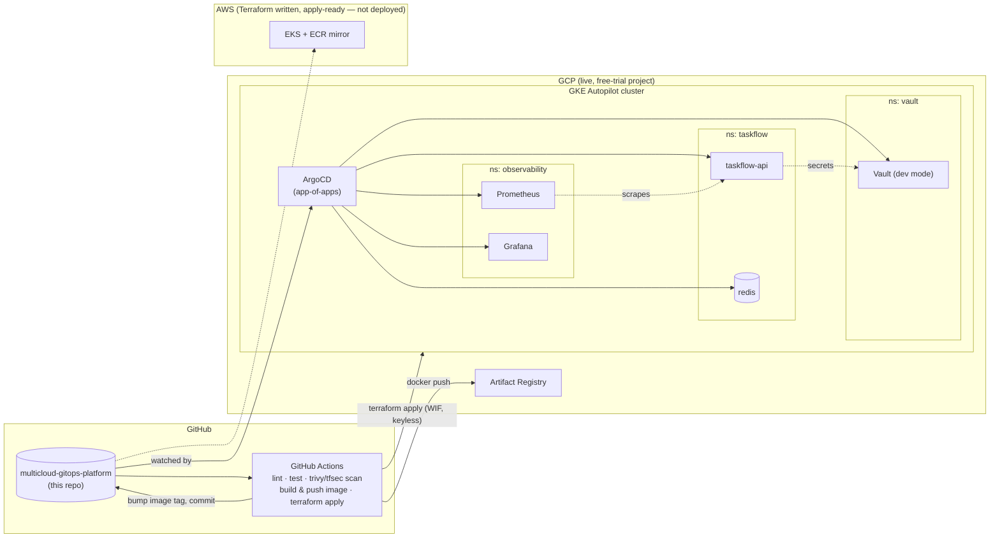

# Multi-Cloud GitOps Platform

A small task-tracking API, deployed to GKE the way a real platform team would
run it: Terraform for infra, GitHub Actions for CI/CD, ArgoCD for GitOps,
Prometheus/Grafana for observability, and HashiCorp Vault for secrets — with
an AWS/EKS mirror ready to apply for the multi-cloud story. Built as a
portfolio project to back up the claims on my resume with something a
reviewer can actually click through and inspect.

## Architecture



The loop that matters: **CI builds an image → commits the new tag back to
`gitops/k8s/base` → ArgoCD notices the git change and syncs it to the
cluster.** Nothing is ever `kubectl apply`'d by hand.

## Screenshots

**ArgoCD — app-of-apps synced**


**Grafana — SLO & deploy-frequency dashboard, live traffic**


**Live API — real request/response**


## What this proves (resume → repo)

| Resume line | Where it lives here |
|---|---|
| AWS • GCP • Azure • GovCloud, multi-cloud | [`infra/gcp`](infra/gcp) (live) + [`infra/aws`](infra/aws) (apply-ready EKS mirror) |
| Kubernetes orchestration, Helm, EKS/GKE | [`infra/gcp/gke.tf`](infra/gcp/gke.tf), [`gitops/k8s/base`](gitops/k8s/base), [`gitops/argocd`](gitops/argocd) |
| GitOps/ArgoCD deployments | App-of-apps pattern in [`gitops/argocd/apps`](gitops/argocd/apps); CI → git → ArgoCD loop in [`.github/workflows/ci.yml`](.github/workflows/ci.yml) |
| Terraform IaC | [`infra/gcp`](infra/gcp), [`infra/aws`](infra/aws) — remote state, keyless auth, no hardcoded secrets |
| CI/CD automation | [`.github/workflows/ci.yml`](.github/workflows/ci.yml), [`.github/workflows/deploy.yml`](.github/workflows/deploy.yml) |
| DevSecOps | `trivy` image scanning + `tfsec` IaC scanning in `ci.yml`, non-root container user in [`app/api/Dockerfile`](app/api/Dockerfile) |
| Observability, SLIs/SLOs, DORA metrics | [`observability/`](observability) — kube-prometheus-stack + a Grafana dashboard with error-rate/latency SLIs and a deploy-frequency panel |
| HashiCorp Vault, secrets lifecycle | [`security/vault/`](security/vault) — Vault dev-mode + Kubernetes auth + policy/role, consumed via Vault Agent injection |
| FinOps: cost governance, tagging | Consistent `labels`/`tags` on every resource in both Terraform stacks; SPOT node group + single NAT gateway on AWS, Autopilot (pay-per-pod) + `google_billing_budget` alert on GCP |
| Zero-downtime deployments | Rolling `Deployment` + `HorizontalPodAutoscaler` in [`gitops/k8s/base`](gitops/k8s/base) |

## Repo layout

```
app/api/            FastAPI + Redis task service (the thing being deployed)
infra/gcp/           Terraform: VPC, GKE Autopilot, Artifact Registry, WIF, budget — live
infra/aws/           Terraform: VPC, EKS, ECR — apply-ready, not deployed (see infra/aws/README.md)
gitops/argocd/       ArgoCD install values + app-of-apps definitions
gitops/k8s/base/     Kustomize manifests ArgoCD actually syncs
observability/       kube-prometheus-stack values + Grafana dashboard
security/vault/      Vault values + one-time init job + injection demo
.github/workflows/   ci.yml (build/scan/push/gitops-bump), deploy.yml (terraform + ArgoCD bootstrap)
docs/bootstrap.md    One-time gcloud setup (Cloud Shell) before the first deploy
```

## Getting started

1. Read [`docs/bootstrap.md`](docs/bootstrap.md) — a ~10 minute, copy-paste
   Cloud Shell setup (state bucket, Workload Identity Federation, deploy
   service account). No local Terraform/gcloud install needed; everything
   after that runs inside GitHub Actions.
2. Push to `main` (or run the `deploy` workflow manually) — this applies the
   Terraform, then bootstraps ArgoCD, which pulls in everything else.
3. `kubectl port-forward svc/argocd-server -n argocd 8080:443` to watch the
   sync in the ArgoCD UI, or `-n observability svc/kube-prometheus-stack-grafana 3000:80`
   for the dashboard.

## Cost

Everything here is sized for a free-trial budget: GKE Autopilot (pay-per-pod,
no idle node cost), short Prometheus retention with no persistent volumes,
Vault in dev mode, SPOT capacity on the (undeployed) AWS side. Run
`terraform destroy` in `infra/gcp` once you're done capturing a demo — it's
all code, so standing it back up is one `terraform apply` away.

## Phase 2 (documented, not built)

- Deploy the AWS/EKS mirror live alongside GCP for a true active multi-cloud demo.
- Consul for service discovery/mesh alongside Vault.
- SonarCloud static analysis (needs an external account) alongside `trivy`/`tfsec`.
- Four Keys-style full DORA metrics pipeline instead of the lightweight Grafana annotation approach used now.
